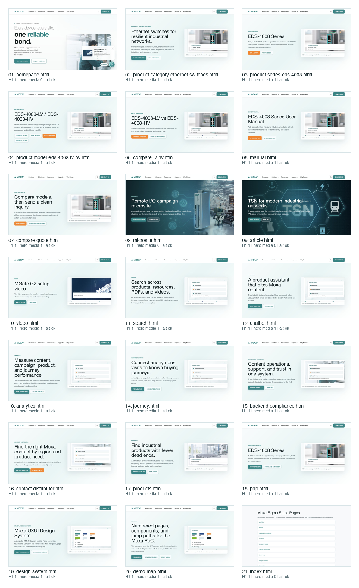

# Moxa POC Pages Completion & Design-System Audit

Date: 2026-07-14  
Audit target: `moxa-figma-static-pages`  
Design-system basis: `Moxa_Website_DS_Phase1_Bilingual_Package`  
Evidence: 21 browser screenshots at 1280 x 720, saved in `screenshots-1280/`

## Overall verdict

The POC page set is complete for design walkthrough readiness. All 21 HTML pages render successfully. The 17 workflow/detail pages that did not have strong banner evidence now include a DS-aligned hero media visual sourced from the completed POC banner image set. Homepage, microsite, and article retain their stronger image-led hero patterns; `index.html` remains a utility launcher.

## What was completed

- Added `banner/hero-media/` with 17 cropped hero visuals derived from the approved banner design images.
- Updated 17 POC workflow/detail pages with a two-column hero: semantic copy and CTA on the left, visual evidence panel on the right.
- Added missing metadata readiness basics: each page now has one H1, a meta description, a canonical URL, and image alt coverage.
- Fixed `manual.html` and `compare-lv-hv.html` so their first-screen hero owns the H1 and the body intro is H2.
- Updated `README.md` to document the new external hero-media assets.

## Design-system alignment

Confirmed strengths:

- Brand tokens, low-radius geometry, Moxa green/blue/orange accents, header, mega navigation, sticky subnav, card, table, form, and CTA patterns are consistent across the customer-facing pages.
- The new hero-media treatment follows the DS direction for industrial authenticity, task-first hierarchy, reusable templates, and evidence-led product storytelling.
- The pages now avoid the previous no-banner gap while preserving the existing page routing and component inventory.
- Browser evidence confirms 21/21 pages have one H1, metadata description, canonical URL, and no missing image alt attributes.

Remaining release gaps:

- JSON-LD/schema markup is still not implemented; this remains a release hardening item for SEO/GEO/AIO.
- CSS tokens are still page-local variables rather than a governed Figma-code-CMS token package.
- Accessibility is visually and structurally improved, but this audit does not prove full keyboard order, screen-reader output, reduced-motion behavior, or WCAG 2.2 AA contrast for every state.
- Interactions remain POC-grade: search, AI, quote, analytics, and CMS handoff need backend/state-machine validation before production.

## Page status

| # | Page | Health | Hero evidence |
| --- | --- | --- | --- |
| 1 | `homepage.html` | Complete; existing image-led hero retained and metadata passed. | `screenshots-1280/01-homepage.png` |
| 2 | `product-category-ethernet-switches.html` | Complete for POC walkthrough; DS hero-media added and metadata passed. | `screenshots-1280/02-product-category-ethernet-switches.png` |
| 3 | `product-series-eds-4008.html` | Complete for POC walkthrough; DS hero-media added and metadata passed. | `screenshots-1280/03-product-series-eds-4008.png` |
| 4 | `product-model-eds-4008-lv-hv.html` | Complete for POC walkthrough; DS hero-media added and metadata passed. | `screenshots-1280/04-product-model-eds-4008-lv-hv.png` |
| 5 | `compare-lv-hv.html` | Complete for POC walkthrough; DS hero-media added and metadata passed. | `screenshots-1280/05-compare-lv-hv.png` |
| 6 | `manual.html` | Complete for POC walkthrough; DS hero-media added and metadata passed. | `screenshots-1280/06-manual.png` |
| 7 | `compare-quote.html` | Complete for POC walkthrough; DS hero-media added and metadata passed. | `screenshots-1280/07-compare-quote.png` |
| 8 | `microsite.html` | Complete; existing image-led hero retained and metadata passed. | `screenshots-1280/08-microsite.png` |
| 9 | `article.html` | Complete; existing image-led hero retained and metadata passed. | `screenshots-1280/09-article.png` |
| 10 | `video.html` | Complete for POC walkthrough; DS hero-media added and metadata passed. | `screenshots-1280/10-video.png` |
| 11 | `search.html` | Complete for POC walkthrough; DS hero-media added and metadata passed. | `screenshots-1280/11-search.png` |
| 12 | `chatbot.html` | Complete for POC walkthrough; DS hero-media added and metadata passed. | `screenshots-1280/12-chatbot.png` |
| 13 | `analytics.html` | Complete for POC walkthrough; DS hero-media added and metadata passed. | `screenshots-1280/13-analytics.png` |
| 14 | `journey.html` | Complete for POC walkthrough; DS hero-media added and metadata passed. | `screenshots-1280/14-journey.png` |
| 15 | `backend-compliance.html` | Complete for POC walkthrough; DS hero-media added and metadata passed. | `screenshots-1280/15-backend-compliance.png` |
| 16 | `contact-distributor.html` | Complete for POC walkthrough; DS hero-media added and metadata passed. | `screenshots-1280/16-contact-distributor.png` |
| 17 | `products.html` | Complete for POC walkthrough; DS hero-media added and metadata passed. | `screenshots-1280/17-products.png` |
| 18 | `pdp.html` | Complete for POC walkthrough; DS hero-media added and metadata passed. | `screenshots-1280/18-pdp.png` |
| 19 | `design-system.html` | Complete for POC walkthrough; DS hero-media added and metadata passed. | `screenshots-1280/19-design-system.png` |
| 20 | `demo-map.html` | Complete for POC walkthrough; DS hero-media added and metadata passed. | `screenshots-1280/20-demo-map.png` |
| 21 | `index.html` | Utility launcher; complete for POC package navigation. | `screenshots-1280/21-index.png` |

## Evidence limits

This audit is based on rendered screenshots, DOM checks, and source inspection. It does not certify production WCAG compliance, real Sitecore/CMS integration, CRM submission, analytics events, or live AI/search behavior.
