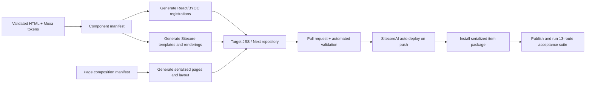

# Moxa PoC — SitecoreAI Automation Blueprint

Date: 2026-07-21  
Status: implementation-ready contract; target SitecoreAI repository and credentials still required

## Outcome

The PoC has one machine-readable source of truth for components, page templates, page compositions, and demonstrations:

- `sitecoreai/component-manifest.json` — 23 reusable components, field contracts, rendering mode, and GenScript reuse decision.
- `sitecoreai/page-compositions.json` — 12 page classes, 13 customer-facing routes, 10 templates, and ordered component compositions.
- `sitecoreai/demo-journeys.json` — 38 demonstrations across six customer-journey stages with explicit evidence and platform boundaries.
- `sitecoreai/interaction-contract.json` — clickable behavior, states, events, motion/accessibility, and integration boundaries.

The deployment generator must consume these files. The 12 SitecoreAI routes must not be recreated one-by-one in Page Builder. `compare-lv-hv.html` remains the approved external HTML conversation-design demonstration.

## Architecture decision

Use two implementation modes behind one Moxa design system:

1. **Hybrid BYOC** for interaction-heavy components: Header, Advisor, AI search, campaign overlay, homepage membership modal, floating navigation, accordions, search facets/results, video, manual navigator, 360 viewer, and lead form.
2. **Structured Sitecore renderings** for content-led components: hero, card grids, metrics, product series/model content, comparison tables, and resource lists.

Sitecore recommends hybrid rendering whenever possible because it combines server prerendering with client behavior. BYOC schemas also generate the author configuration UI, eliminating a separate manual configuration form for each component.

## Automated delivery flow



### 1. Generate code and author schemas

- Map each component `id` to a stable React export and Sitecore rendering name.
- Generate `registerComponent` definitions from each component's `properties` and `required` fields.
- Add author-facing labels, descriptions, groups, validation, and thumbnails.
- Import hybrid components through the target repository's hybrid BYOC index.
- Keep all visual decisions in the shared Moxa tokens/CSS layer; do not fork colors, type, spacing, radii, or controls per page.

### 2. Generate Sitecore structural items

- Create templates, fields, rendering items, placeholder rules, standard values, and branch/page templates from the manifests.
- Generate the 12 Sitecore page routes and their ordered renderings from `page-compositions.json`.
- Use shared data templates for EDS-4008 and NPort series pages; use one Product Model template with separate LV/HV datasources.
- Store all generated structural items as Sitecore Content Serialization YAML.

### 3. Build and deploy

- Validate manifests and generated code.
- Build the target JSS/Next application.
- Create an SCS package as the build artifact.
- Push the reviewed branch. SitecoreAI auto-deploy-on-push builds and deploys the application when enabled for the environment.
- Install the SCS package non-interactively with protected client credentials.
- Publish and monitor the publishing job.

Representative CLI operations, finalized against Stephen's repository conventions:

```text
dotnet sitecore ser pkg create -o artifacts/moxa-poc.itempackage
dotnet sitecore ser pkg install -f artifacts/moxa-poc.itempackage \
  --client-id <secret> --client-secret <secret> \
  --cm <cm-host> --auth <identity-host>
```

Sitecore Content Serialization is the source of truth for templates, renderings, layouts, placeholder settings, and site structure. Media should use the project's approved media ingestion path rather than SCS at scale.

### 4. Verify after deployment

Run the acceptance suite in this order:

1. 12 Sitecore route smoke checks plus the external comparison route.
2. Shared Header, Breadcrumb, Footer, Advisor, locale default, and responsive behavior.
3. Component rendering and author-field schema checks.
4. Cross-route links and six journey handoffs.
5. Search intent and facet default behavior.
6. Lead-form validation, consent, success, and error states.
7. Accessibility, responsive layout, performance budget, and broken-asset scans.
8. 38-operation demo evidence capture with environment URL, timestamp, result, and screenshot/log.

## Required inputs from Stephen / Arthur

The generator can be connected without redesign work after these values are provided:

| Input | Why it is required |
|---|---|
| Target repository and base branch | File placement, pull request, and deployment trigger |
| JSS/Next and Sitecore SDK versions | Imports, component-factory convention, build compatibility |
| Sitecore organization, project, environment, and site identifiers | Deployment and page/item target |
| Rendering host / editing host convention | BYOC and Pages registration |
| `sitecore.json`, module naming, and serialization root | Generated YAML/package placement |
| Placeholder and component group conventions | Author library organization |
| Media library strategy and CDN host | Image/PDF/video ingestion and URL rewrite |
| Non-interactive client credentials in CI secrets | Package installation and publishing |
| CRM/form endpoint contract | Replace simulated lead submission |
| Search endpoint/index contract | Replace front-end search simulation |

## Guardrails

- No credentials in the repository or handoff archive.
- No manual construction of the 12 pages after generation.
- No claim that the LV/HV chatbot is native SitecoreAI capability.
- No component-specific visual token forks.
- No production deployment until automated tests pass in the target test environment.
- Rollback is a release redeploy plus prior SCS package; the package and commit SHA must be retained as release evidence.

## Official references

- [Bring your own components](https://doc.sitecore.com/sai/en/developers/sitecoreai/bring-your-own-components.html)
- [The registerComponent method](https://doc.sitecore.com/sai/en/developers/jss/217/jss-sai/the-registercomponent-method.html)
- [Sitecore Command Line Interface](https://doc.sitecore.com/sai/en/developers/sitecoreai/sitecore-command-line-interface.html)
- [Sitecore Content Serialization](https://doc.sitecore.com/sai/en/developers/sitecoreai/sitecore-content-serialization.html)
- [Set up Content Serialization](https://doc.sitecore.com/sai/en/developers/sitecoreai/sitecore-content-serialization/set-up-content-serialization.html)
- [Create and install an SCS package](https://doc.sitecore.com/sai/en/developers/sitecoreai/create-and-install-a-sitecore-content-serialization-package.html)
- [Deploy a project and environment](https://doc.sitecore.com/sai/en/developers/sitecoreai/getting-started-with-sitecoreai/deploy-a-project-and-environment.html)
